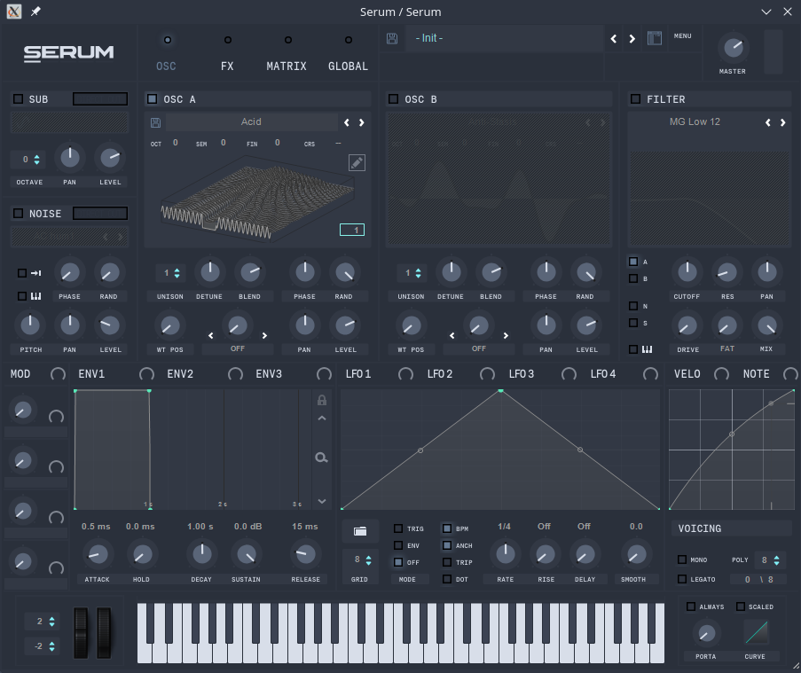
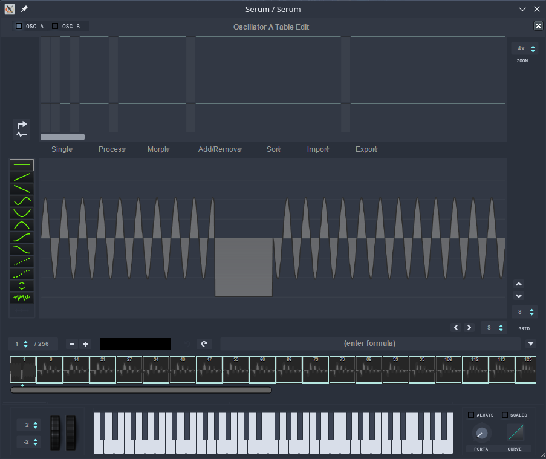
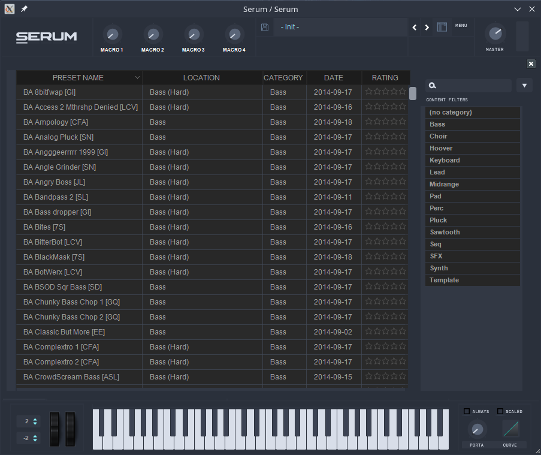

# Serum Nord Skin

## Introduction

This is a custom Skin for Serum based mainly on colors definded by the [Nord Theme](https://www.nordtheme.com/).

Initially I've created this for using it myself with a little help by the [Skin Generator for Serum VST](https://sad-easley-fb32f0.netlify.app/) created by [REXTR909](https://www.reddit.com/user/rextr909/)

## Screenshots

### Oscillators

### Oscillators Editor

### FX

### Matrix<

### Global

### Presets browser

## Installation

Clone this repo and copy the folder **Nord** into your Serum Skin folder.

For Windows this should be: **C:\Users\USERNAME\Documents\Xfer\Serum Presets\Skins**

For MacOS: **~/Library/Audio/Presets/Xfer Records/Serum Presets/Skins**

For Linux: **~/.wine/drive_c/users/USERNAME/Documents/Xfer/Serum Presets/Skins**

I'm in no way affiliated with Xfer / Serum and you are using the provided skin at your own risk. Please see [License.md](License.md) for more information.
